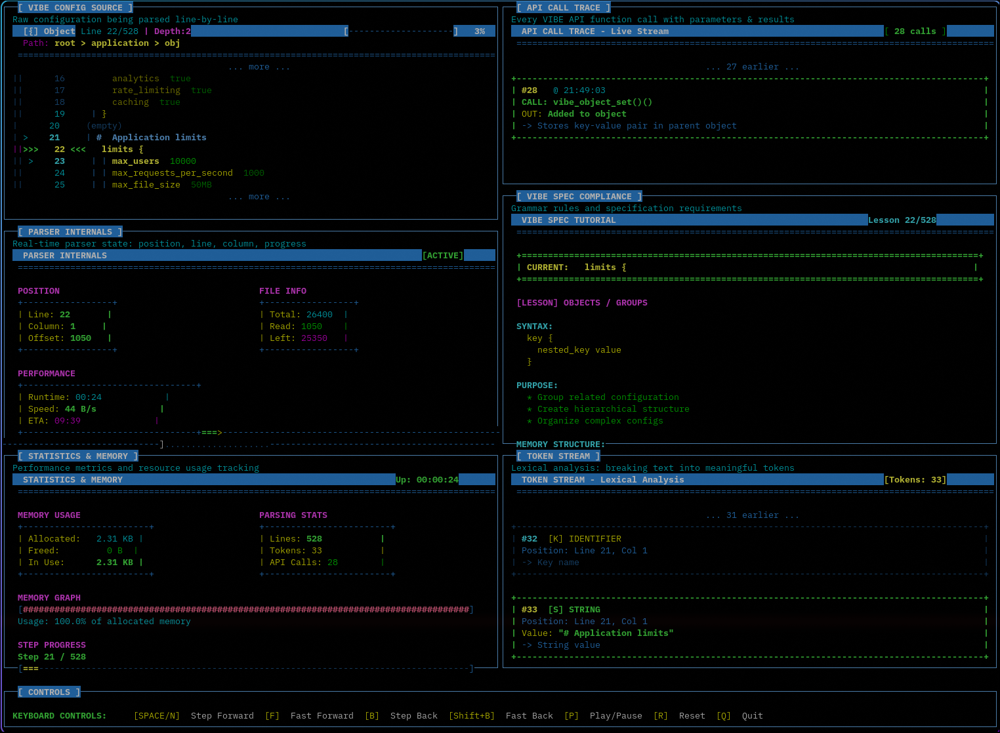

# VIBE 🌊

[](https://opensource.org/licenses/MIT)
[](https://en.wikipedia.org/wiki/C11_(C_standard_revision))
[](https://github.com/1ay1/vibe)
[](tests/conformance)

**VIBE** (Values In Bracket Expression) is a configuration language with one
radical rule: **every structured thing has a name.** No anonymous records, no
implicit type magic, no significant whitespace. The structure you see is the
structure you get.

```vibe
server {
  host localhost
  port 8080
}
features [auth api cache]      # arrays hold scalars — that's the whole trick
```

## The First Law of VIBE

> **An array MUST NOT contain an object or another array.**

Every other format lets you write an anonymous list of records
(`replicas: [{...}, {...}]`) — and every such list is a latent bug: the entries
have no stable identity, they're addressed by a fragile index, and reordering
silently rebinds every reference. VIBE forbids it. If a thing is worth
structuring, it's worth naming. This isn't a missing feature — it's
[the entire point](docs/Stability_Paradox.md).

## What VIBE Promises

- **One Parse** — the same bytes produce the same value tree in every conforming
  parser, forever. There are *no* ambiguous documents. Prove otherwise and it's a
  spec bug we'll fix.
- **Named Entities** — no anonymous records, no `[0]`-addressed objects.
- **No Surprises** — a value is exactly what it looks like.
- **Frozen Grammar** — locked for all of 1.x; your config parses identically
  forever.
- **Conformance-Tested** — a [language-neutral suite](tests/conformance) decides
  what "conforming" means. Not an honor system.

## No Footguns

- **No "Norway problem."** `country no` is the string `"no"`, never `false`.
- **No number magic.** `2.1.0` is a string; `10:30` is a string; `007` is `7`.
- **No significant whitespace.** Indentation is decoration — re-indent freely.
- **No trailing-comma errors.** There are no separators to get wrong.
- **No silent truncation.** An out-of-range integer is *rejected*, not clamped.

## What VIBE Refuses (on purpose)

Arrays-of-objects · anchors/references · variable substitution · includes ·
conditionals · templates · implicit type coercion. Each one re-introduces the
ambiguity or non-locality VIBE exists to kill. If you need those, you've outgrown
a config *format* and want a config *language* (CUE, Jsonnet) or plain code — and
we'll cheer you on.

> **VIBE is for configuration humans write by hand — not data machines exchange.**
> For APIs and wire formats, use JSON. We mean it.

## 📖 Quick Example

```vibe
# Application configuration
application {
  name "My Awesome App"
  version 2.1.0
  debug false
}

server {
  host localhost
  port 8080

  ssl {
    enabled true
    cert_path /etc/ssl/cert.pem
  }
}

# Server pool
servers [
  prod1.example.com
  prod2.example.com
  prod3.example.com
]

# Feature flags
features {
  new_ui true
  beta_api false
  analytics true
}
```

## 🚀 Quick Start

### Installation

```bash
git clone https://github.com/1ay1/vibe.git
cd vibe
make              # builds libvibe.a, libvibe.so, and the `vibe` CLI
```

Install the library, CLI, and pkg-config file system-wide:

```bash
sudo make install PREFIX=/usr/local
```

This installs `libvibe.a` + `libvibe.so` (with SONAME), the `vibe.h` header,
the `vibe` command-line tool, and `vibe.pc` for pkg-config.

### 🖥️ Command-Line Tool

The `vibe` CLI ships with the library:

```bash
vibe check config.vibe        # validate; prints a structured error on failure
vibe fmt   config.vibe        # reformat to canonical VIBE (add -w to rewrite)
vibe get   config.vibe server.port    # read a scalar at a dotted path
vibe version
```

`vibe check` reports failures as `file:line:col: error [category]: message`,
where `category` is one of the stable error codes (`unclosed-object`,
`nested-container`, `invalid-number`, …).

### 🎮 Interactive Parsing Tool

VIBE includes a powerful **interactive parsing tool** with a beautiful TUI (Terminal User Interface) that visualizes the parsing process step-by-step:



```bash
make parser_tool
./vibe_parser_tool examples/simple.vibe
```

**Features:**
- 📊 Real-time visualization of parsing steps
- 🎯 Current line highlighting with yellow background
- 🔍 Token stream analysis with color-coded types
- 📚 Interactive VIBE spec tutorial that teaches as you parse
- 🔄 API call tracing with detailed parameters and results
- 💾 Memory and performance statistics
- ⏮️ Step forward/backward navigation
- 🎨 Modern card-based UI with ASCII art

**Keyboard Controls:**
- `SPACE/N` - Step forward
- `B` - Step backward
- `Shift+B` - Fast backward (rewind to start)
- `F` - Fast forward (jump to end)
- `P` - Play/Pause auto-play mode
- `R` - Reset to beginning
- `Q` - Quit

Perfect for learning VIBE syntax, debugging configs, and understanding how the parser works!

### Basic Usage

**Step 1:** Create a VIBE config file (`config.vibe`):

```vibe
# My application config
application {
  name "My Awesome App"
  version 1.0
  debug false
}

server {
  host localhost
  port 8080

  ssl {
    enabled true
    cert /etc/ssl/cert.pem
  }
}

servers [
  prod1.example.com
  prod2.example.com
  prod3.example.com
]
```

**Step 2:** Parse and use it in C (`myapp.c`):

```c
#include "vibe.h"
#include <stdio.h>

int main() {
    // 1. Create parser
    VibeParser* parser = vibe_parser_new();

    // 2. Parse the config file
    VibeValue* config = vibe_parse_file(parser, "config.vibe");

    if (!config) {
        VibeError error = vibe_get_last_error(parser);
        fprintf(stderr, "Error at line %d: %s\n", error.line, error.message);
        vibe_parser_free(parser);
        return 1;
    }

    // 3. Access values using dot notation paths
    //    Format: "object.nested_object.key"
    const char* name = vibe_get_string(config, "application.name");
    int64_t port = vibe_get_int(config, "server.port");
    bool debug = vibe_get_bool(config, "application.debug");
    bool ssl = vibe_get_bool(config, "server.ssl.enabled");

    printf("Application: %s\n", name ? name : "Unknown");
    printf("Port: %lld\n", (long long)port);
    printf("Debug mode: %s\n", debug ? "ON" : "OFF");
    printf("SSL: %s\n", ssl ? "enabled" : "disabled");

    // 4. Access arrays
    VibeArray* servers = vibe_get_array(config, "servers");
    if (servers) {
        printf("\nServers (%zu total):\n", servers->count);
        for (size_t i = 0; i < servers->count; i++) {
            VibeValue* server = servers->values[i];
            if (server->type == VIBE_TYPE_STRING) {
                printf("  %zu. %s\n", i + 1, server->as_string);
            }
        }
    }

    // 5. Clean up (frees entire config tree)
    vibe_value_free(config);
    vibe_parser_free(parser);

    return 0;
}
```

**Step 3:** Compile and run (header-only — nothing to link):

```bash
gcc -o myapp myapp.c -std=c11    # myapp.c does #define VIBE_IMPLEMENTATION
./myapp
```

**Output:**
```
Application: My Awesome App
Port: 8080
Debug mode: OFF
SSL: enabled

Servers (3 total):
  1. prod1.example.com
  2. prod2.example.com
  3. prod3.example.com
```

## 📚 Documentation

### Full API Reference

For complete API documentation with detailed examples, see **[docs/API.md](docs/API.md)**

**Quick Links:**
- [Parser Management](docs/API.md#parser-management) - Creating and managing parsers
- [Parsing Functions](docs/API.md#parsing-functions) - Parse strings and files
- [Value Access](docs/API.md#value-access) - Access values with dot notation
- [Object Operations](docs/API.md#object-operations) - Working with objects
- [Array Operations](docs/API.md#array-operations) - Working with arrays
- [Memory Management](docs/API.md#memory-management) - Cleanup and freeing
- [Error Handling](docs/API.md#error-handling) - Handling parse errors
- [Complete Examples](docs/API.md#usage-examples) - Full working examples

### Syntax Overview

#### Simple Assignment
```vibe
key value
```

#### Objects
```vibe
database {
  host localhost
  port 5432
}
```

#### Arrays
```vibe
ports [8080 8081 8082]

servers [
  server1.com
  server2.com
  server3.com
]
```

#### Data Types

- **Integers**: `42`, `-17`
- **Floats**: `3.14`, `-0.5`
- **Booleans**: `true`, `false`
- **Strings**: `"quoted"` or `unquoted` (for simple values)

#### Comments
```vibe
# Full line comment
key value  # Inline comment
```

#### String Escaping
```vibe
message "Hello \"World\""
path "C:\\Users\\Name"
unicode "Hello 世界"
```

### API Reference

#### Parser Management
```c
VibeParser* vibe_parser_new(void);
void vibe_parser_free(VibeParser* parser);
```

#### Parsing Functions
```c
VibeValue* vibe_parse_string(VibeParser* parser, const char* input);
VibeValue* vibe_parse_file(VibeParser* parser, const char* filename);
```

#### Value Access
```c
VibeValue* vibe_get(VibeValue* root, const char* path);
const char* vibe_get_string(VibeValue* value, const char* path);
int64_t vibe_get_int(VibeValue* value, const char* path);
double vibe_get_float(VibeValue* value, const char* path);
bool vibe_get_bool(VibeValue* value, const char* path);
VibeArray* vibe_get_array(VibeValue* value, const char* path);
VibeObject* vibe_get_object(VibeValue* value, const char* path);
```

#### Object & Array Operations
```c
void vibe_object_set(VibeObject* obj, const char* key, VibeValue* value);
VibeValue* vibe_object_get(VibeObject* obj, const char* key);
void vibe_array_push(VibeArray* arr, VibeValue* value);
VibeValue* vibe_array_get(VibeArray* arr, size_t index);
```

#### Cleanup
```c
void vibe_value_free(VibeValue* value);
```

#### Error Handling
```c
VibeError vibe_get_last_error(VibeParser* parser);
void vibe_error_free(VibeError* error);
```

### Full Specification

For the complete format specification, see [SPECIFICATION.md](SPECIFICATION.md).

## 🌍 Language Bindings

VIBE's reference parser is a small C library (**libvibe**) with a stable C ABI,
so any language with a foreign-function interface can read and write VIBE
without re-implementing the parser. The [`bindings/`](bindings/) directory has a
real, runnable binding for **25 languages** — 24 of them verified end-to-end by
actually executing them against `libvibe.so`:

> Python · Ruby · Lua · Perl · PHP · Node.js · JavaScript (WebAssembly) ·
> Julia · Rust · Go · C++ · Zig · Swift · D · Nim · Crystal · Java · Kotlin ·
> C#/.NET · Haskell · OCaml · Racket · Guile · CHICKEN Scheme · Tcl

Every binding parses the same `sample.vibe` and asserts the same values, so the
bindings cross-check each other. Run the whole matrix with
[`bindings/run_all.sh`](bindings/run_all.sh) (missing toolchains are skipped, not
failed). See [bindings/README.md](bindings/README.md) for the shared ABI and a
template for adding your own — if your language speaks C, it can speak VIBE.

## 🎯 Why VIBE?

VIBE doesn't win a feature checklist — it makes a **bet**: give up two "features"
(anonymous records and implicit type coercion) and get, in return, a format with
**no ambiguous documents and no positional identity.**

- **vs JSON** — JSON is for machines; VIBE is for humans (comments, no comma/quote
  noise). VIBE concedes data-interchange to JSON entirely.
- **vs YAML** — VIBE keeps the readability and drops every trap: significant
  whitespace, the Norway problem, anchors/aliases.
- **vs TOML** — closest in spirit, but TOML's arrays-of-tables bring back anonymous
  records; VIBE forbids them (the First Law).

**Choose VIBE when** you hand-write configuration and want it obvious,
unambiguous, and diff-friendly. **Don't** choose it for data interchange (JSON),
references/multi-doc streams (YAML), or logic/templating (a real language or
CUE/Jsonnet). Picking the right tool is the good vibe.

## 🔨 Building & Testing

### Build
```bash
make                 # Build everything
make clean           # Clean build artifacts
```

### Run Examples
```bash
make demo            # Quick demo
make test            # Run all tests
./vibe_example simple.vibe
./vibe_example config.vibe
```

### Integration

libvibe is a **single-header library** — the whole implementation lives in
`vibe.h`. Three ways to use it, simplest first:

**Option A — header-only (stb-style, zero build).** Copy just `vibe.h` into your
project. In exactly one `.c` file, define the implementation macro before
including it; every other file includes it plainly:

```c
#define VIBE_IMPLEMENTATION   /* in ONE translation unit only */
#include "vibe.h"
```
```bash
cc -std=c11 -o myapp myapp.c        # nothing else to compile or link
```
Add `#define VIBE_STATIC` alongside `VIBE_IMPLEMENTATION` to give every function
internal linkage (no exported symbols, maximal inlining) — ideal for embedding.

**Option B — link the installed library.** After `make install`:

```bash
cc -std=c11 -o myapp myapp.c $(pkg-config --cflags --libs vibe)
```

**Option C — vendor two files.** Copy `vibe.h` + the tiny `vibe.c` shim (it just
`#define VIBE_IMPLEMENTATION` + `#include "vibe.h"`) and add `vibe.c` to your build:

```bash
cc -std=c11 -o myapp myapp.c vibe.c
```

Any way, `#include <vibe.h>` (installed) or `#include "vibe.h"` (vendored). The
library has no dependencies beyond the C standard library.

## 📋 Examples

Check out the `examples/` directory for more usage examples:
- `simple.vibe` - Basic configuration with simple arrays
- `config.vibe` - Complex nested structure using named objects
- `web_server.vibe` - Web server configuration example
- `database.vibe` - Database configuration with replicas
- `example.c` - Complete C usage example

## 🤝 Contributing

Contributions are welcome! Please see [CONTRIBUTING.md](CONTRIBUTING.md) for guidelines.

### Areas for Contribution
- Additional language implementations (Python, Rust, Go, JavaScript) — run them
  against the [conformance suite](tests/conformance) to prove they agree
- Editor plugins (VS Code, Vim, Emacs)
- `vibe convert` importers (JSON/TOML/YAML → VIBE)
- More conformance test cases

## 📜 License

This project is licensed under the MIT License - see the [LICENSE](LICENSE) file for details.

## 🗺️ Roadmap

- [x] Core parser implementation (C)
- [x] Complete, conformance-grade specification
- [x] Language-neutral conformance test suite
- [x] Packaged C library (`libvibe`: static + shared, pkg-config) with a `vibe` CLI
- [x] `vibe fmt` canonical formatter
- [ ] `\uXXXX` escapes (v1.1) + candidate multi-line strings
- [ ] Python / Rust / Go / JS implementations (each conformance-verified)
- [ ] VS Code + Vim syntax highlighting
- [ ] `vibe convert` importers

*(Notably **not** on the roadmap, by design: variable substitution, includes,
conditionals, templates, anchors. See [What VIBE Refuses](SPECIFICATION.md#future-considerations).)*

## 📞 Support

- 📖 Read the [Specification](SPECIFICATION.md)
- 💬 Open an [Issue](https://github.com/1ay1/vibe/issues)
- 🌟 Star the project if you find it useful!

## 🎉 Acknowledgments

Inspired by the need for a configuration format that is:
- Simpler and safer to hand-edit than YAML (no whitespace traps, no Norway problem)
- More readable than JSON (comments, less punctuation)
- More opinionated than TOML (every structured value has a name)

VIBE's north star: **a config format with no ambiguous documents.**

---

**Keep calm and VIBE on!** 🌊

*Configuration doesn't have to be complicated. Sometimes the best solution is the one that just feels right.*
